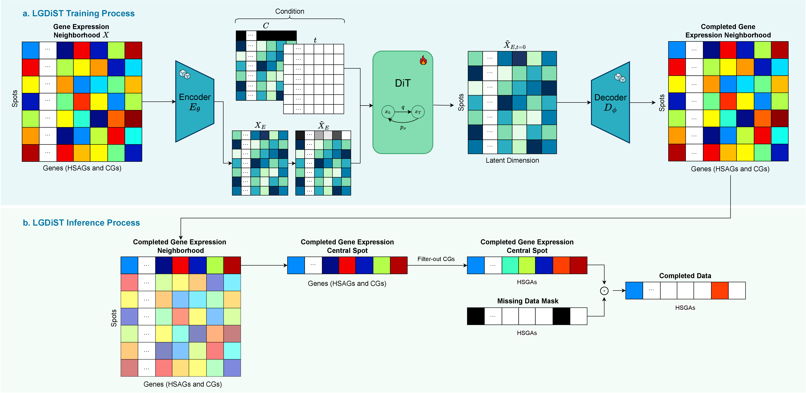

# Pytorch implementation of LGDiST: Latent Gene Diffusion for Spatial Transcriptomics Completion

### Authored by Paula Cárdenas, Leonardo Manrique*, Daniela Vega*, Daniela Ruiz and Pablo Arbeláez



**Abstract**

Computer Vision has proven to be a powerful tool for analyzing Spatial Transcriptomics (ST) data. However, current models that predict spatially resolved gene expression from histopathology images suffer from significant limitations due to data dropout. Most existing approaches rely on single-cell RNA sequencing references, making them dependent on alignment quality and external datasets while also risking batch effects and inherited dropout. In this paper, we address these limitations by introducing LGDiST, the first reference-free latent gene diffusion model for ST data dropout. We show that LGDiST outperforms the previous state-of-the-art in gene expression completion, with an average Mean Squared Error that is 18% lower across 26 datasets. Furthermore, we demonstrate that completing ST data with LGDiST improves gene expression prediction performance on six state-of-the-art methods up to 10% in MSE. A key innovation of LGDiST is using context genes previously considered uninformative to build a rich and biologically meaningful genetic latent space. Our experiments show that removing key components of LGDiST, such as the context genes, the ST latent space, and the neighbor conditioning, leads to considerable drops in performance. These findings underscore that the full architecture of LGDiST achieves substantially better performance than any of its isolated components.

## News:

* _13/7/2025_: LGDiST has been accepted as an **oral presentation** in the ICCV workshop of [Computer Vision for Automated Medical Diagnosis](https://cvamd.github.io/CVAMD2025/)

## Set up

Run the following to define your environment in the terminal:

```bash
conda create -n st
conda activate st
conda install python==3.10.0
conda install pytorch torchvision torchaudio pytorch-cuda=11.7 -c pytorch -c nvidia
pip install torch_geometric
pip install pyg_lib torch_scatter torch_sparse torch_cluster torch_spline_conv -f https://data.pyg.org/whl/torch-2.0.0+cu117.html
pip install squidpy
pip install wandb
pip install wget
```

The datasets from SpaRED are available in [the official database webpage](https://bcv-uniandes.github.io/spared_webpage/).

All the instructions regarding data pre-processing can be found [here](datasets)


## Autoencoder

The first step to use LGDiST with the SpaRED dataset or your own Spatial Transcriptomics data is training the autoencoder for gene expression neighborhoods:

```bash
cd LGDiST/autoencoder
python train_autoencoder.py --dataset $dataset_name$
```

Where the substring `$dataset_name$` must be replaced by one of the 26 SpaRED datasets. This will train the neighborhood autoencoder and save the results inside the `LGDiST/autoencoder/results` directory. 

## Training the data completion model

Once you have the neighborhood autoencoder, you can train the completion diffusion model with the following commands: 

```bash
cd LGDiST/gene_completion
python main.py --autoencoder_ckpts_path $ae_checkpoints_path$ --dataset $dataset_name$ --pred_layer $prediction_layer$
```

Here, `$ae_checkpoints_path$` must be the path to the .ckpt file saved during the autoencoder training step and `$prediction_layer$` corresponds to the layer within the adata object that contains the ground truth of the data. To replicate the results in the paper, you have to run this command with `c_d_deltas` as the prediction layer, since this layer contains the data that was pre-completed with the median completion strategy.

As a result, the script will save the checkpoints of the data completion model inside the `LGDiST/gene_completion/results/$prediction_layer$/$dataset_name$` directory. 

## Data completion inference

To use the trained diffusion model for completing real-missing data in the Spatial Transcriptomics dataset you need to run this command:
```bash
cd LGDiST/gene_completion
python inference_completion.py --autoencoder_ckpts_path $ae_checkpoints_path$ --dataset $dataset_name$ --pred_layer $prediction_layer$ --dit_ckpts_path $dit_checkpoints_path$
```
Similar to the diffusion training phase, `$ae_checkpoints_path$` is the path to the .ckpt file that corresponds to the trained autoencoder and `$prediction_layer$` corresponds to the layer used to train the diffusion model and the one where the pre-completed or missing values will be replaced by LGDiST.

For best results, we encourage running the diffusion training step along with the inference step twice. This allows LGDiST to improve its final completion prediction once it is trained in the second stage using the data pre-completed with its own initial predictions. In this sense, the suggested protocol is:

1. AutoEncoder training.
2. DiT training using the *median pre-completed* data (`c_d_deltas`) as `$prediction_layer$`.
3. Completing real-missing data with LGDiST inference script (use the same `$prediction_layer$` from step 2).
4. DiT training using the *LGDiST pre-completed* data (automatically saved as `c_StepA_deltas` in step 3) as `$prediction_layer$`.
5. Completing real-missing data with LGDiST inference script (use the same `$prediction_layer$` from step 4).

The final completion results are automatically saved in layer `c_StepB_deltas` during step 5.

## Citation

```

```
